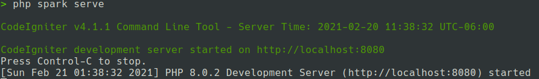
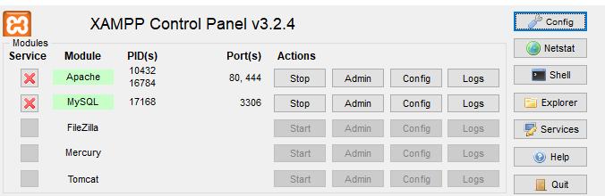
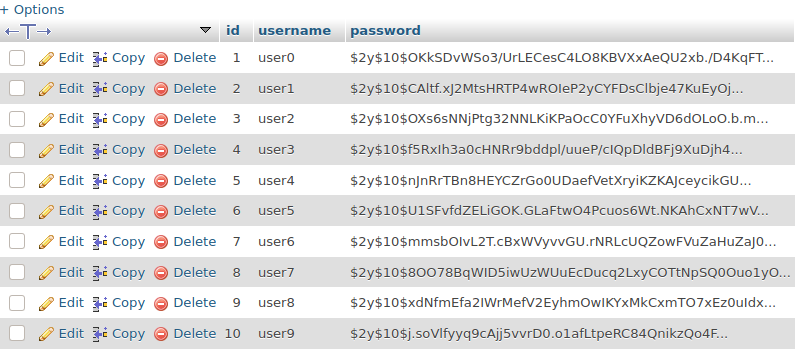
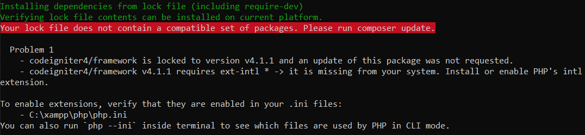

# Barter system ⚡️
Barter system using Code Igniter 4

<br>

## Installation ▶️

### Prerequisite

- [Composer](https://getcomposer.org/Composer-Setup.exe)

- PHP version 7.3 or higher is required

<br>

> Start xampp's apache & mysql

> open CMD and type the following:

`git clone https://github.com/Simperfy/Barter-system.git`

`cd Barter-system`

`composer install`

`composer setup`

`composer refresh-db`

That's it your done!

> start server (using cmd/terminal)

`php spark serve`

You should see output like this:


Goto http://localhost:8080 to browse the website.

<details>
    <summary>More details</summary>

> If you need to drop all tables

`php spark migrate:rollback`

> If you need to quickly drop && create tables + populate with fake data

`php spark migrate:refresh && php spark db:seed BaseSeeder`

or

`composer refresh-db`

</details>

<br>

## Manual Database Installation ⏩

If the above instructions did not work you may try these steps below.

<br>

<details>
    <summary>Installation (alternative way)</summary>

> Start xampp's apache & mysql



> create/replace `.env` file

```
CI_ENVIRONMENT = development
app.baseURL = 'http://localhost:8080/'
database.default.hostname = localhost
database.default.database = barter_system
database.default.username = root
database.default.password = ''
database.default.DBDriver = MySQLi
```

> Create database called `barter_system`

Goto http://localhost/phpmyadmin

click "new" *(located in left most panel)*

type "barter_system" *(without quotes)*

then click "create"

`barter_system` should now appear in the list of of your databases:


> migrate database

`php spark migrate`

`php spark db:seed BaseSeeder`

> check results

your `users` table should look like this:


</details>

<br>

## Troubleshooting ❗️

> In case you got an error like below:



open `C:\xampp\php\php.ini` using any text editor

delete "`;`" in "`;extension = intl`"
```diff
-;extension=intl
+extension=intl
```

<br>

> ['php' is not recognized as an internal or external command](https://stackoverflow.com/questions/31291317/php-is-not-recognized-as-an-internal-or-external-command-in-command-prompt/31291404)

<br>

> In case of spam reloads due to `live server`:

Goto File > preference > settings

search for `@ext:ritwickdey.liveserver Ignore Files`

click `Edit in settings.json`

add the following lines, and restart the live server.
```diff
"liveServer.settings.ignoreFiles":[
    ...
+    "vendor/**",
+    "writable/**",
]
```

<br>

## Authors 🏅

Contributions Badge based on [allcontributors.org](https://allcontributors.org/docs/en/emoji-key)

> Will update badges in the future accordingly

<table>
  <tr>
      <td align="center">
          <a href="https://github.com/briellers">
              
              <br/>
              <sub>
                  <b>briellers</b>
              </sub>
          </a>
          <br/>
          <a href="#" title="Design">🎨</a>
      </td>
      <td align="center">
          <a href="https://github.com/DauntlessDev">
              
              <br/>
              <sub>
                  <b>DauntlessDev</b>
              </sub>
          </a>
          <br/>
          <a href="#" title="Business">💼</a>
          <a href="#" title="Database Design">🔣</a>
          <a href="#" title="Main Frontend">🖼️</a>
          <a href="#" title="Event Organizing">📋</a>
          <a href="#" title="Ideas/Planning">🤔</a>
      </td>
      <td align="center">
          <a href="https://github.com/Hezzz">
              
              <br/>
              <sub>
                  <b>Hezzz</b>
              </sub>
          </a>
          <br/>
          <a href="#" title="Main Backend">🕹</a>
          <a href="#" title="Business">💼</a>
          <a href="#" title="Database Design">🔣</a>
          <a href="#" title="Documentation">📖</a>
      </td>
      <td align="center">
          <a href="https://github.com/Simperfy">
              
              <br/>
              <sub>
                  <b>Simperfy</b>
              </sub>
          </a>
          <br/>
          <a href="#" title="Backend">🕹</a>
          <a href="#" title="Design/Prototype">🎨</a>
          <a href="#" title="Documentation">📖</a>
          <a href="#" title="Frontend">🖼️</a>
          <a href="#" title="Infrastructure/DevOps">🚇</a>
          <a href="#" title="Tutorial">✅</a>
      </td>
      <td align="center">
          <a href="https://github.com/stormy26">
              
              <br/>
              <sub>
                  <b>Stormy26</b>
              </sub>
          </a>
          <br/>
          <a href="#" title="Business">💼</a>
      </td>
  </tr>
</table>