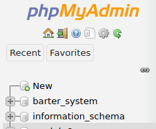

# PSA-6 (Module 6 Activity)
PSA6-Technical-MySQL-Database using Code Igniter 4

Can be run without xampp all you need is MySQL

<br>

## Installation :arrow_forward:

> open terminal/cmd and type the following:

`git clone https://github.com/app-dev-5/PSA6-CI.git`

`cd PSA6-CI`

`composer update`

> Copy `env` to `.env` and tailor for your app, specifically the `CI_ENVIRONMENT` and any `database` settings.

```diff
-# CI_ENVIRONMENT = production
...
-# database.default.hostname = localhost
-# database.default.database = ci4
-# database.default.username = root
-# database.default.password = root
-# database.default.DBDriver = MySQLi
+CI_ENVIRONMENT = development
...
+database.default.hostname = localhost
+database.default.database = module6
+database.default.username = root
+database.default.password = ''
+database.default.DBDriver = MySQLi
```

> start server

`php spark serve`

You should see output like this:


Goto http://localhost:8080 to browse the website.

<br>

## Installation part 2 (Database) :fast_forward:
> Start xampp's apache & mysql


> Create database called `module6`

Goto http://localhost/phpmyadmin

click "new" *(located in left most panel)*

type "module6" *(without quotes)*

then click "create"

`module6` should now appear in the list of of your databases:


> migrate database

`php spark migrate`

`php spark db:seed BaseSeeder`

> check results

your `module6` database should contain the following:


your `dogs` table should look like this:


<br>

## Server Requirements :gear:

- [Composer](https://getcomposer.org/)

- PHP version 7.3 or higher is required, with the following extensions installed

<br>

## Authors

<table>
  <tr>
      <td align="center">
          <a href="https://github.com/Simperfy">
              
              <br/>
              <sub>
                  <b>Simperfy</b>
              </sub>
          </a>
          <br/>
          <a href="#" title="Frontend">🖼️</a>
          <a href="#" title="Backend">🕹</a>
          <a href="#" title="Documentation">📖</a>
      </td>
  </tr>
</table>